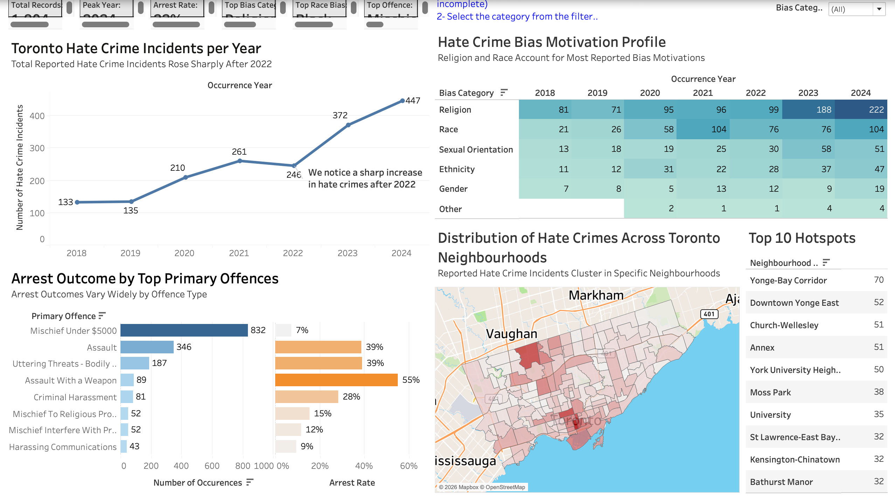

Project Overview

Reported hate crime incidents in Toronto increased sharply after 2022. This project explores whether that increase was associated with particular bias motivations, neighbourhoods, offence types, and arrest outcomes. The analysis supports moving from a general city-wide response toward targeted monitoring, prevention, outreach, reporting support, and enforcement review.

## Research Questions

1. Have reported hate crime incidents increased or decreased over time?
2. Which bias motivations drive the observed pattern?
3. Where are reported incidents geographically concentrated?
4. How do arrest outcomes vary by primary offence type?

## Dataset

- **Source:** [Toronto Police Service Public Safety Data Portal](https://data.torontopolice.on.ca/)
- **Dataset:** Toronto Police Service Hate Crime Open Data
- **Scope:** Verified hate crime occurrences investigated by the Hate Crime Unit
- **Analysis period:** 2018–2024
- **Records analyzed:** 1,804
- **Measures used:** occurrence year, reported incident count, bias category, neighbourhood, primary offence, and arrest outcome

The 2025 records were excluded from the main analysis because the year was incomplete and could have produced a misleading comparison with complete calendar years.

## Analysis Views

The Tableau analysis is organized around four principal views:

| View | Purpose | Visualization |
|---|---|---|
| Annual incident trend | Tracks changes in reported hate crime incidents between 2018 and 2024 | Line chart |
| Bias motivation profile | Compares reported incidents by bias category and year | Highlight table/heat map |
| Toronto neighbourhood hotspots | Shows where reported incidents are geographically concentrated | Choropleth map |
| Arrest outcomes by offence | Compares offence volume with arrest rate across leading primary offences | Horizontal bar charts |

The exact internal Tableau dashboard and worksheet names should be added after checking the packaged workbook.

## Key Findings

### 1. Reports surged after 2022

Reported incidents rose from **133 in 2018** to **447 in 2024**, the highest annual total in the analysis period. The strongest growth occurred after 2022, supporting more frequent monitoring rather than a one-time response.

### 2. Religion and race shaped the overall pattern

Religion and race accounted for most reported bias motivations. Religion-related reports became especially prominent in 2023 and 2024, reaching **222 reported incidents in 2024**. Prevention and outreach should therefore be adapted to the communities represented in the data.

### 3. Incidents were geographically concentrated

Reported incidents clustered in particular Toronto neighbourhoods instead of being distributed evenly across the city. These counts should be interpreted carefully: concentration may also reflect population density, visitor traffic, public spaces, and differences in reporting patterns.

### 4. Arrest outcomes varied by offence type

**Mischief Under $5,000** was the most frequently reported primary offence, with **832 occurrences**, but its arrest rate was approximately **7%**. Less frequent violent offences displayed substantially higher arrest shares. This suggests that high-volume offences with low arrest outcomes may represent an important enforcement challenge.

### 5. Overall arrest rate

The dataset-level arrest rate presented in the analysis was approximately **22%**.

## Recommendations

- **Monitor the increase more frequently:** Review incident patterns quarterly so emerging changes can be identified earlier.
- **Tailor prevention initiatives:** Design outreach around the communities and bias categories most represented in the data, particularly religion- and race-related incidents.
- **Prioritize hotspot areas:** Use the neighbourhood analysis to guide outreach, prevention resources, and reporting support.
- **Review enforcement gaps:** Examine why high-volume offences such as Mischief Under $5,000 have comparatively low arrest outcomes and identify opportunities to improve follow-up processes.

## Tools and Skills

- Tableau Desktop
- Data cleaning and preparation
- Exploratory data analysis
- Calculated measures and key performance indicators
- Time-series analysis
- Geographic analysis and mapping
- Interactive dashboard design
- Data storytelling and business recommendations

## Limitations and Responsible Interpretation

- The analysis covers **reported and verified incidents**, not every hate-motivated incident that may have occurred.
- Changes in reporting behaviour, awareness, police practices, or data collection may affect trends over time.
- Neighbourhood totals are counts rather than population-adjusted rates.
- Geographic concentration should not be interpreted as evidence that a neighbourhood or its residents cause hate crime.
- The findings identify descriptive patterns and do not establish causation.

## Acknowledgements

Data was provided through the Toronto Police Service Public Safety Data Portal. This repository is an educational data-analysis project and is not affiliated with or endorsed by the Toronto Police Service.

## License

No reuse license has been assigned to the group project. Confirm agreement from all team members and review the source dataset's terms before adding an open-source license or redistributing embedded data.

